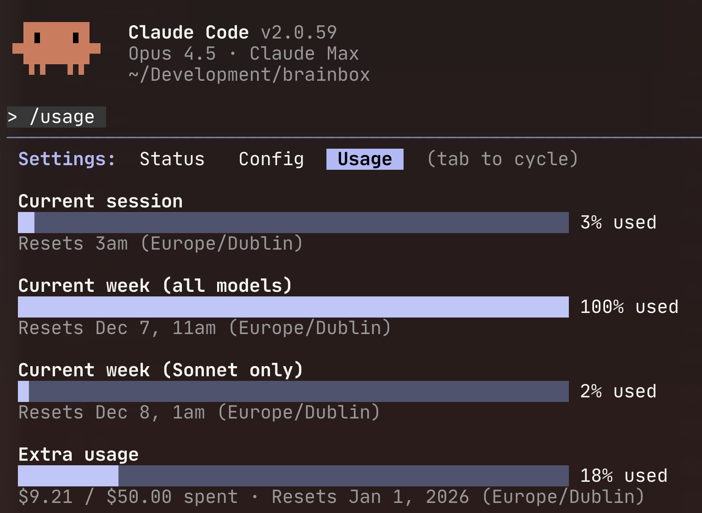

<div align="center">


# ClaudeBurst

</div>

A macOS menubar app that notifies you when your Claude Code session allowance refreshes.

## Features

- Menubar-only app (doesn’t appear in Dock by default)
- Plays an inspirational sound effect when the Claude Code allowance window rolls over
- Shows a local notification: “A new Claude Code session has begun!” with 5-hour time range subtitle
- Settings window to choose notification sound from among a set of nostalgic jingles
- Shows current session and next session time in the menu
- Preview button to test selected sound

## Building & Installation

### Prerequisites

ClaudeBurst is open source and you build it locally yourself without needing an Apple Developer Account. You will need to be on macOS 12.0+, and have Xcode available, with Command Line Tools (`xcode-select --install`).

### Using Build Script (Recommended)

In your Terminal, check out the project from GitHub and run:

```bash
cd ClaudeBurst

# Build only
./build.sh

# Build and move to /Applications
./build.sh --install
```

The `--install` flag will clean build, kill any old running instance, copy to `/Applications`, and launch the app for you.

### Using Xcode

1. Open `ClaudeBurst.xcodeproj` in Xcode
2. Select "ClaudeBurst" scheme
3. Build (Cmd+B) or Run (Cmd+R)
4. The built app will be in `build/Build/Products/Release/ClaudeBurst.app`
5. Copy `ClaudeBurst.app` to `/Applications`

### Manual Installation

1. Build the app using either method above
2. Copy `ClaudeBurst.app` to `/Applications`
3. Launch the app — it will appear in your menubar with the ClaudeBurst icon
4. Grant notification permissions when prompted

## Usage

- Click the menubar icon to see:
  - **Current session** - e.g., “Current: 5pm–10pm”
  - **Next session** - e.g., “Next session at 10pm”
  - **Settings...** - Configure notification sound and dock visibility
  - **Test Notification** - Preview the notification and sound
  - **Quit** - Exit the app

- If you use Claude Code on multiple machines, you may need to send Claude a message to sync your existing session data.

## Session Timing Source



ClaudeBurst reads Claude Code's JSONL log files from:

```
~/.claude/projects/**/*.jsonl
```

It parses timestamps from these files to calculate 5-hour session windows. The session calculation logic is adapted from [Claude-Code-Usage-Monitor](https://github.com/Maciek-roboblog/Claude-Code-Usage-Monitor) (MIT licensed).

The app runs without App Sandbox because it needs to read Claude Code’s log files at `~/.claude/projects/`, which is outside the sandbox container.

### How Session Windows Work

- **Window duration**: 5 hours (matching Claude Code's rolling limit)
- **Window start**: Truncated to the current hour in UTC (e.g., 10:56 → 10:00, matching Claude Code's `/usage` behavior)
- **New window triggers**: When the previous window expires, or after a 5+ hour gap in activity
- **Lookback period**: 24 hours of logs are scanned for recent activity

The app watches the projects directory for changes and updates the display when new activity is logged.

## Adding Custom Sounds

This app combines two sources at runtime:

1) **Baked-in sounds (build time)** — place `.mp3`, `.wav`, `.m4a`, or `.mp4` files in `./sounds` (repo root) before building. The folder is bundled as `sounds` inside the app.
2) **User sounds (runtime)** — add your own files to `~/Library/Application Support/ClaudeBurst/Sounds`. These are merged with the baked-in sounds when the app is run; if names clash, the runtime file wins.

Notes:
- Invalid files in Application Support are ignored (e.g., empty files or unsupported audio).
- Use the “Open Sounds Folder” button in Settings to jump to the runtime folder.
- The app watches the Application Support folder and refreshes the Settings list automatically.
- Sounds in `./sounds` are bundled at build time; move files there and rebuild to update the baked-in list.

## Complementary Projects

Other tools for monitoring Claude Code usage:

- **[Claude-Code-Usage-Monitor](https://github.com/Maciek-roboblog/Claude-Code-Usage-Monitor)** by [@Maciek-roboblog](https://github.com/Maciek-roboblog) — Real-time terminal monitor with Rich UI, ML-based predictions, and support for Pro/Max plans.
- **[ccusage](https://github.com/ryoppippi/ccusage)** by [@ryoppippi](https://github.com/ryoppippi) — CLI tool for analyzing Claude Code usage from local JSONL files. Shows daily, monthly, and session-based usage with cost tracking.
- **[ccusage-monitor (macOS)](https://github.com/joachimBrindeau/ccusage-monitor)** by [@joachimBrindeau](https://github.com/joachimBrindeau) — Minimal macOS menu bar app for tracking API usage and billing cycles.
- **[ccseva](https://github.com/Iamshankhadeep/ccseva)** by [@Iamshankhadeep](https://github.com/Iamshankhadeep) — macOS menu bar app built with Electron and React for real-time usage tracking.

## License

MIT License
